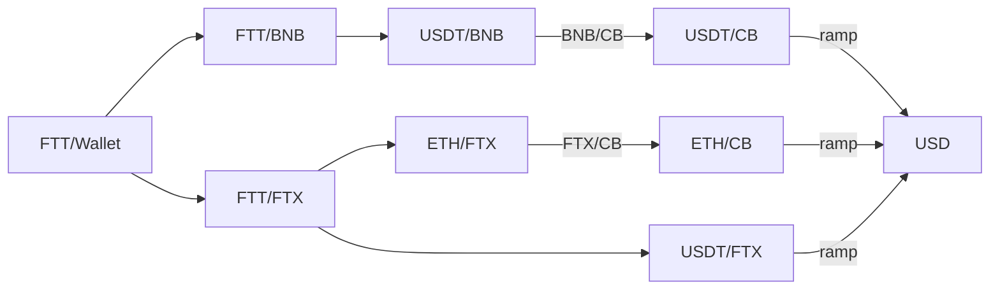

# Ubuntu mini-PC

Instructions for setting up Beelink SEi, mini-PC desktop with Windows 10/11 into a Ubuntu box with a 2T SSD hard disk. 

1. __Out of the box hardware__

    |  |  |
    |------------|---------------|
    | manufacture | Beelink New 8th Generation | 
    | processor    | Intel 4 Cores 8 Threads i5-8259U Processor(up to 3.8GHz) |
    | RAM | 16G DDR4 RAM |
    | HD | 500GB NVMe M.2 SSD |
    | display | 4K Dual HDMI Display |
    | WiFi  | WiFi5,BT5.0 | 
    | connectors | 4*USB 3.0 | 

2. __Hardware Upgrades__ 
    - Samsung 870 EVO, 2TB SSD
        - open mini-pc
        - find docking and insert SSD
> Note the SSD needs to be mounted once Ubuntu is installed

3. __Download Ubuntu ISO File__:
    - Download the latest version of Ubuntu to laptop (MacBookPro) from the official Ubuntu [website](https://ubuntu.com/download).
        - Make select 64-bit system

4. __Create a Bootable USB Drive__:
    - Insert USB flash drive into USB port on laptop
        - Preinstalled Window 10/11 will be erased during this process
    - Download and install on laptop [__Etcher__](https://www.balena.io/etcher/) a USB drive bootable creation tool ([Rufus](https://rufus.ie/) an alternative)
    - Open the bootable creation tool, select the downloaded Ubuntu ISO file from Step 1, and choose the USB drive you want to use for the installation
    - Click the "_Start_" or "_Create_" button to begin creating the bootable USB drive

5. __Set Up__ the BIOS/UEFI:
    - Restart your computer and access the BIOS/UEFI settings by pressing __ESC__ (could also use __Delete__, F2, F12 ) during startup.
    - In the BIOS/UEFI settings, change the boot order to prioritize the USB drive. 
        - This will ensure that the computer boots from the USB drive during startup.

6. __Install Ubuntu__:
    - Save the changes made to the BIOS/UEFI settings and exit. Your computer will now boot from the Ubuntu USB drive.
    - Select "Install Ubuntu" from the boot menu.
    - Follow the on-screen instructions to select your language, time zone, keyboard layout, and other preferences.
    - When prompted, choose the installation option "__Erase disk and install Ubuntu__". 
    - Create a username and password for your Ubuntu account.
    - Wait for the installation to complete. Once done, restart your computer.
    - Ubuntu will now boot up, and you can start using your newly installed Ubuntu operating system.
    
7. __Install additional Unix cl apps__:
    - `sudo apt install curl`
    - `sudo apt update`
    - `sudo apt install -y git gcc g++ make cmake pkg-config llvm-dev libclang-dev clang`

8. __Install Rust and Go__:
    - Rust
        - `curl --proto '=https' --tlsv1.2 sSf https://sh.rustup.rs | sh`
        - `source "$HOME/.cargo/env`
    - Go
        - Download from [go.dev](https://go.dev/dl/)
        - Remove any previous Go installation by deleting the `/usr/local/go` folder 
            - `rm -rf /usr/local/go`
        - Extract the archive you just downloaded into `/usr/local`, creating a fresh Go tree in `/usr/local/go`
            - `tar -C /usr/local -xzf go1.20.7.linux-amd64.tar.gz`

8. __Install Brave Browser__:
    - `sudo curl -fsLo /usr/share/keyrings/brave-browser-archive-keyring.gpg https://brave-browser-apt-release.s3.brave.com/brave-browser-archive-keyring.gpg`
    - `sudo apt install brave-browser`
    - launch by `/bin/brave-browser`

9. __Mounting SSD hard disk__:
    - Boot up Ubuntu and open a cl (command line) terminal
    - Use  _`sudo lsblk -o NAME,FSTYPE,SIZE,MOUNTPOINT,LABEL`_ to find SSD and mounting point (usually SSD appears as 'sda', 'sdb', 'sdc')
    - For a one time mount:
        - creat directory for mounting point `mkdir /mnt/ssd`
        - mount SSD `sudo mount /dev/sda /mnt/ssd`
    - For a mounting upon opening terminal:
    - use `blkid` to find UUID
    - edit `/etc/fstab` and add a new line at eof
    ```
    UUID=<UUID #> /mnt/ssd ext4 defaults,nofail 0 2
    ```
    - verify mounting with `sudo lsblk -f`

10. __Installing Anaconda__: ([source](https://www.makeuseof.com/install-anaconda-on-ubuntu/))
    -  Update Linux system repositories: `sudo apt-get update`
    -  Upgrade the system packages: `sudo apt-get upgrade`
    - Install wget: `sudo apt-get install wget`
    - Go to /tmp: `cd /tmp`
    - Download the package:
        - `wget https://repo.anaconda.com/archive/Anaconda3-2022.05-Linux-x86_64.sh`
        - `wget https://repo.anaconda.com/archive/Anaconda3-2023.07-2-Linux-x86_64.sh`
    -  Verify hash code integrity
        - compute:
            - `sha256sum Anaconda3-2022.05-Linux-x86_64.sh`
            - `sha256sum Anaconda3-2023.07-2-Linux-x86_64.sh`
        - verfy match with code on Official Anaconda [webpage](`https://repo.anaconda.com/archive/`)
    - Run the Anaconda Bash shell script:
        - `bash Anaconda3-2022.05-Linux-x86_64.sh`
        - `bash Anaconda3-2023.07-2-Linux-x86_64.sh`
    - Verify Installation
        - `conda info`
        - `conda --version`
    - Update and upgrade
        - `conda update conda`
        - `conda update anaconda`


