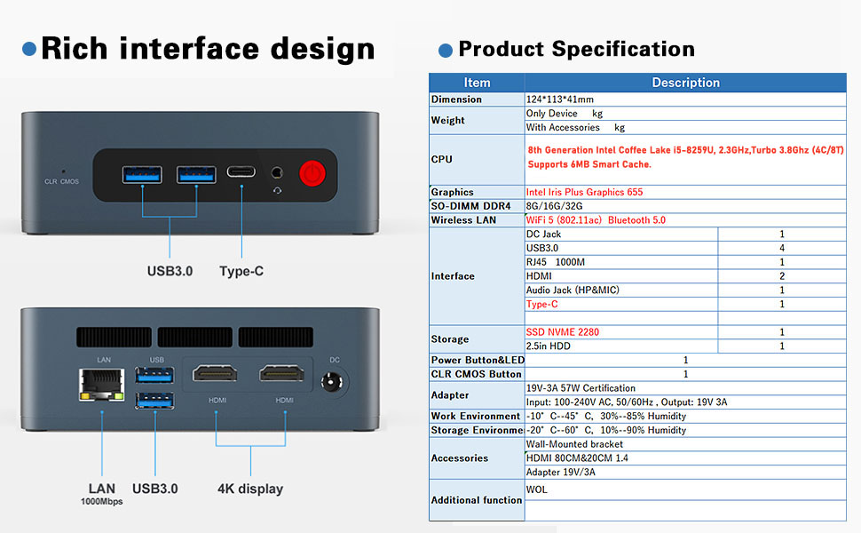

# Ubuntu mini-PC

1. Hardware

    |  |  |
    |------------|---------------|
    |  | Beelink New 8th Generation | 
    | processor    | Intel 4 Cores 8 Threads i5-8259U Processor(up to 3.8GHz) |
    | RAM | 16G DDR4 RAM |
    | HD | 500GB NVMe M.2 SSD |
    | display | 4K Dual HDMI Display |
    | WiFi  | WiFi5,BT5.0 | 
    | connectors | 4*USB 3.0 | 

1. Download the Ubuntu ISO File:
    - Download the latest version of Ubuntu to your laptop from the official Ubuntu [website](https://ubuntu.com/download).
    - Make sure to select the appropriate version (e.g., 64-bit or 32-bit) based on your system's architecture.
2. Create a Bootable USB Drive:
    - Insert your USB flash drive into an available USB port on your computer.
        - Note that all data on the USB drive will be erased during this process, so back up any important files.
    - Download and install a USB drive bootable creation tool like [__Etcher__](https://www.balena.io/etcher/) or [Rufus](https://rufus.ie/).
    - Open the bootable creation tool, select the Ubuntu ISO file you downloaded in Step 1, and choose the USB drive you want to use for the installation.
    - Click the "_Start_" or "_Create_" button to begin creating the bootable USB drive.

3. Set Up the BIOS/UEFI:
    - Restart your computer and access the BIOS/UEFI settings. The method to do this can be pressing __Delete__, or __ESC__, F2, F12 during startup.
    - In the BIOS/UEFI settings, change the boot order to prioritize the USB drive. 
        - This will ensure that the computer boots from the USB drive during startup.

4. Install Ubuntu:
    - Save the changes made to the BIOS/UEFI settings and exit. Your computer will now boot from the Ubuntu USB drive.
    - Select "Install Ubuntu" from the boot menu.
    - Follow the on-screen instructions to select your language, time zone, keyboard layout, and other preferences.
    - When prompted, choose the installation option "__Erase disk and install Ubuntu__". 
    - Create a username and password for your Ubuntu account.
    - Wait for the installation to complete. Once done, restart your computer.

5. Boot into Ubuntu:
    - Ubuntu will now boot up, and you can start using your newly installed Ubuntu operating system.