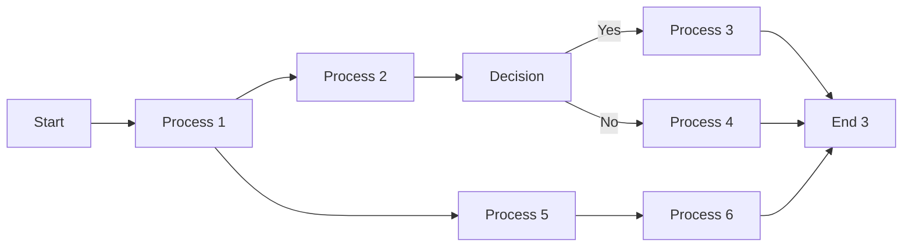
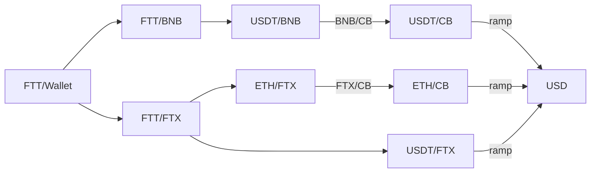

# Ubuntu mini-PC

Instructions for setting up Beelink SEi, mini-PC desktop with Windows 10/11 into a Ubuntu box with a 2T SSD hard disk. 

1. __Our of the box hardware__

    |  |  |
    |------------|---------------|
    | manufacture | Beelink New 8th Generation | 
    | processor    | Intel 4 Cores 8 Threads i5-8259U Processor(up to 3.8GHz) |
    | RAM | 16G DDR4 RAM |
    | HD | 500GB NVMe M.2 SSD |
    | display | 4K Dual HDMI Display |
    | WiFi  | WiFi5,BT5.0 | 
    | connectors | 4*USB 3.0 | 

2. __Hardware Upgrades__ 
    - Samsung 870 EVO, 2TB SSD
        - open mini-pc
        - find docking and insert SSD
> Note the SSD needs to be mounted once Ubuntu is installed

1. __Download Ubuntu ISO File__:
    - Download the latest version of Ubuntu to laptop (MacBookPro) from the official Ubuntu [website](https://ubuntu.com/download).
        - Make select 64-bit system

2. __Create a Bootable USB Drive__:
    - Insert USB flash drive into USB port on laptop
        - Preinstalled Window 10/11 will be erased during this process
    - Download and install on laptop [__Etcher__](https://www.balena.io/etcher/) a USB drive bootable creation tool ([Rufus](https://rufus.ie/) an alternative)
    - Open the bootable creation tool, select the downloaded Ubuntu ISO file from Step 1, and choose the USB drive you want to use for the installation
    - Click the "_Start_" or "_Create_" button to begin creating the bootable USB drive

3. __Set Up__ the BIOS/UEFI:
    - Restart your computer and access the BIOS/UEFI settings by pressing __ESC__ (could also use __Delete__, F2, F12 ) during startup.
    - In the BIOS/UEFI settings, change the boot order to prioritize the USB drive. 
        - This will ensure that the computer boots from the USB drive during startup.

4. __Install Ubuntu__:
    - Save the changes made to the BIOS/UEFI settings and exit. Your computer will now boot from the Ubuntu USB drive.
    - Select "Install Ubuntu" from the boot menu.
    - Follow the on-screen instructions to select your language, time zone, keyboard layout, and other preferences.
    - When prompted, choose the installation option "__Erase disk and install Ubuntu__". 
    - Create a username and password for your Ubuntu account.
    - Wait for the installation to complete. Once done, restart your computer.
    - Ubuntu will now boot up, and you can start using your newly installed Ubuntu operating system.
    
6. __Mounting SSD hard disk__:
    - Boot up Ubuntu and open a cl (command line) terminal
    - Use  _`sudo lsblk -o NAME,FSTYPE,SIZE,MOUNTPOINT,LABEL`_ to find SSD and mounting point (usually SSD appears as 'sda', 'sdb', 'sdc')
    - For a one time mount:
        - creat directory for mounting point `mkdir /mnt/ssd`
        - mount SSD `sudo mount /dev/sda /mnt/ssd`
    - For a mounting upon opening terminal:
    - use `blkid` to find UUID
    - edit `/etc/fstab` and add a new line at eof
    ```
    UUID=<UUID #> /mnt/ssd ext4 defaults,nofail 0 2
    ```
    - verify mounting with `sudo lsblk -f`




